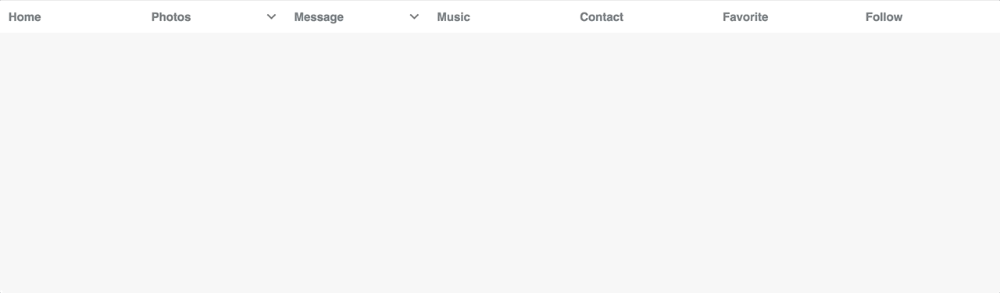

# UiReact - React menu
React reusable multilevel menu component



## Demo in Storybook

## Getting Started
  1. Add uireact-menu `npm install uireact-menu --save`
  2. import core css `import 'uireact-menu/build/uireact-menu.css'`
  3. import theme css `import 'uireact-menu/build/theme.css'`
## Usage

##### Static data
Import menu to your project
```javascript
import React, { Component } from 'react';
import Menu from 'uireact-menu'

<Menu>
  <Menu.Item>item 1</Menu.Item>
  <Menu.Item>item 2</Menu.Item>
  <Menu.Item>item 3</Menu.Item>
  <Menu.Item>item 4</Menu.Item>
  <Menu.Item>item 5</Menu.Item>
</Menu>
```

##### Static data with Dropdown menu
```javascript
import React, { Component } from 'react';
import Menu from 'uireact-menu'

<Menu>
  <Menu.Item>Home</Menu.Item>
  <Menu.Item>
    <Menu.Label>Photos</Menu.Label>
    <Menu.Sub >
      <Menu.Item>item 2-1</Menu.Item>
      <Menu.Item>item 2-2</Menu.Item>
      <Menu.Item>
        <Menu.Label>item 2-3</Menu.Label>
        <Menu.Sub>
          <Menu.Item>item 2-3-1</Menu.Item>
          <Menu.Item>
            <Menu.Label>item 2-3-1</Menu.Label>
            <Menu.Sub>
              <Menu.Item>item 2-3-1-1</Menu.Item>
              <Menu.Item>item 2-3-1-2</Menu.Item>
              <Menu.Item>item 2-3-1-3</Menu.Item>
            </Menu.Sub>
          </Menu.Item>
          <Menu.Item>item 2-3-2</Menu.Item>
        </Menu.Sub>
      </Menu.Item>
    </Menu.Sub>
  </Menu.Item>
  <Menu.Item>
    <Menu.Label>Message</Menu.Label>
    <Menu.Sub >
      <Menu.Item>item 2-1</Menu.Item>
      <Menu.Item>item 2-2</Menu.Item>
      <Menu.Item>
        <Menu.Label>item 2-3</Menu.Label>
        <Menu.Sub>
          <Menu.Item>item 2-3-1</Menu.Item>
          <Menu.Item>
            <Menu.Label>item 2-3-1</Menu.Label>
            <Menu.Sub>
              <Menu.Item>item 2-3-1-1</Menu.Item>
              <Menu.Item>item 2-3-1-2</Menu.Item>
              <Menu.Item>item 2-3-1-3</Menu.Item>
            </Menu.Sub>
          </Menu.Item>
          <Menu.Item>item 2-3-2</Menu.Item>
        </Menu.Sub>
      </Menu.Item>
    </Menu.Sub>
  </Menu.Item>
  <Menu.Item>Music</Menu.Item>
  <Menu.Item>Contact</Menu.Item>
  <Menu.Item>Favorite</Menu.Item>
  <Menu.Item>Follow</Menu.Item>
</Menu>
```
##### import data from json
```javascript
import React, { Component } from 'react';
import Menu from 'uireact-menu'
const menuData = require('./menu.json')

<Menu data={menuData} />
```
##### import data from Array

```javascript
import React, { Component } from 'react';
import Menu from 'uireact-menu'

const menuData = [{
  'title': 'Menu 1',
  'submenu': [{
    'title': 'Sub Menu1',
    'submenu': [{
      'title': 'Sub sub Menu1',
      'href': '#'
    }, {
      'title': 'Sub sub Menu2',
      'href': '#'
    }]
  }, {
    'title': 'Sub Menu2',
    'href': '#'
  }, {
    'title': 'Sub Menu3',
    'href': '#'
  }]
}, {
  'title': 'Menu 2',
  'submenu': [{
    'title': 'Sub Menu 2',
    'href': '#'
  }]
}, {
  'title': 'Menu 3',
  'href': '#'
}]

<Menu data={menuData} />

```

## Prop
---
After menu was add, it will have the following props:
#### <Menu>

| Name        | Type           | Default  | Description |
| ------------- |:-------------:| -----:| -----:|
| data      | object or array |  | import json data or static menu data |
| direction      | 'horizontal' or 'vertical'      |  'vertical' | menu direction |

#### <Menu.Item>
| Name        | Type           | Default  | Description |
| ------------- |:-------------:| -----:| -----:|
| onClick      | function |  | Menu item click event |
| to      | string      |   | url or link  |

License
----

MIT
